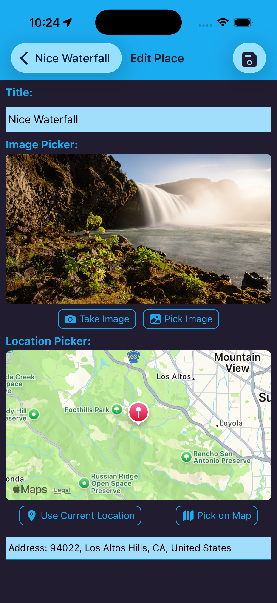
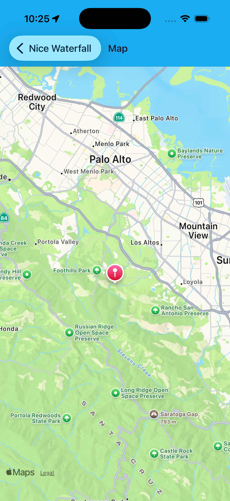
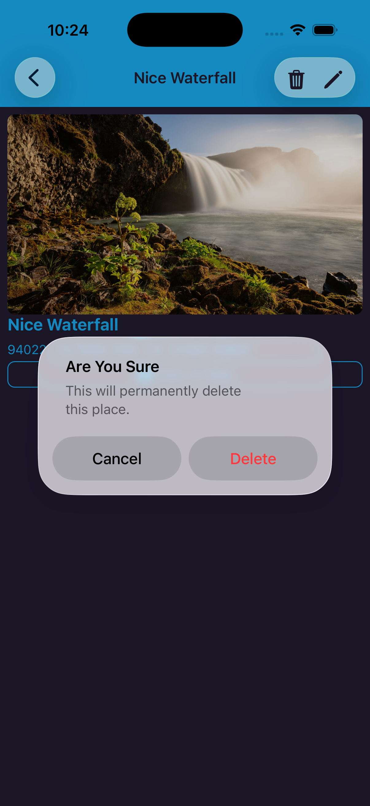

# Favorite Places App

A React Native application to store, manage, and explore your favorite places with photos, locations, and map integration.

## Features

- **Browse Places**: View a scrollable list of all your saved favorite places with thumbnails and addresses
- **Add Places**: Create new place entries with:
  - Title
  - Photo (take a new photo or pick from gallery)
  - Location (use current device location or pick on map)
  - Address (automatically generated from coordinates)
- **Edit Places**: Update existing place details including title, photo, and location
- **Delete Places**: Remove places with a confirmation dialog to prevent accidental deletion
- **View Details**: See full details of each place including a large photo and complete address
- **Map Integration**: 
  - View place locations on an interactive map
  - Pick new locations directly on the map
  - Read-only map view when viewing place details

## Screenshots & Demo

### Places List

*Browse all your saved places in an organized list view*

### Place Details

*View detailed information about a place with photo and location*


### Edit Place Form

*Comprehensive form to update place information with image and location pickers*

### Location Picker

*Interactive map for selecting and confirming place coordinates*

### Delete Confirmation

*Safety confirmation dialog before permanently deleting a place*

### Add & Edit Places

*Complete workflow: add title, capture/select photo, and pick location*


## Getting Started

### Prerequisites
- Node.js and npm
- Expo CLI
- React Native development environment

### Installation

1. Clone the repository
2. Install dependencies:
   ```bash
   npm install
   ```

3. Start the development server:
   ```bash
   npm start
   ```

4. Run on your device or simulator:
   - iOS: `i`
   - Android: `a`
   - Web: `w`

## Tech Stack

- **Framework**: React Native with Expo
- **Navigation**: React Navigation (Native Stack)
- **Database**: SQLite (via expo-sqlite)
- **Maps**: React Native Maps
- **Icons**: Ionicons

## Project Structure

```
src/
├── screens/          # Screen components
├── components/       # Reusable UI components
├── store/           # Database functions
├── model/           # Data models
├── constants/       # App constants (colors, layout)
├── types/           # TypeScript type definitions
└── assets/          # App assets
```

## Key Screens & Components

- **AllPlaces**: Displays list of all saved places
- **PlaceDetails**: Shows detailed view with photo, location, and action buttons
- **AddPlace**: Form for creating and editing places
- **Map**: Interactive map for viewing and selecting locations
- **PlaceForm**: Reusable form component with image and location pickers
- **ImagePicker**: Camera/gallery selection component
- **LocationPicker**: Map-based location selection component

## Database

The app uses SQLite to persist places locally. Each place stores:
- `id`: Unique identifier
- `title`: Place name
- `imageUri`: File path to place photo
- `address`: Location address
- `lat`/`lng`: Geographic coordinates

## Navigation Flow

```
AllPlaces (list)
├─→ PlaceDetails (view)
│   ├─→ Map (read-only)
│   └─→ AddPlace (edit)
└─→ AddPlace (create)
    └─→ Map (select location)
```

## License

MIT

## Run The App

1. Install dependencies:

```bash
npm install
```

2. Start Expo:

```bash
npx expo start
```

3. Run on iOS/Android simulator or Expo Go.

## Tech Stack

- Expo SDK 54
- React Native
- TypeScript
- React Navigation (native stack)
- Firebase Auth (Identity Toolkit REST)
- Firebase Realtime Database
- AsyncStorage
- Axios